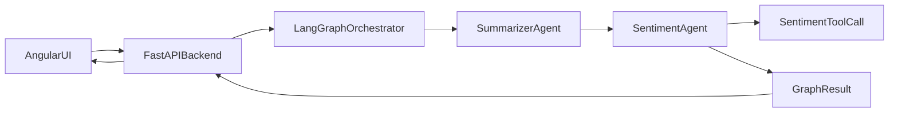

# Multi-agent feedback sentiment – Implementation Guide

## Overview

- **Goal**: Accept raw customer feedback in an Angular app, send it to a FastAPI backend, and run a LangGraph/LangChain multi-agent workflow powered by an Ollama model (`llama3.2`) to:
  - Summarize the feedback.
  - Call a sentiment-analysis tool on the summary.
  - Decide whether the customer is **HAPPY** or **UNHAPPY** and return the verdict to the UI.

## Architecture



- **Summarizer agent**: LLM node that turns raw feedback text into a concise, neutral summary.
- **Sentiment agent**: LLM node that receives the summary, calls a simple keyword-based **sentiment tool**, and uses both inputs to output a final `HAPPY` or `UNHAPPY` verdict plus a reasoning string.
- **FastAPI backend**: Hosts the LangGraph workflow and exposes `POST /feedback/analyze`.
- **Angular UI**: Single-page experience with a feedback textarea and a result card showing summary and sentiment.

## Backend

### Key files

- `backend/app/schemas.py`
  - `FeedbackRequest` with `text: str`.
  - `FeedbackAnalysisResponse` with:
    - `summary: str`
    - `sentiment: Literal["HAPPY", "UNHAPPY", "NEUTRAL"]`
    - `reason: str`
- `backend/app/config.py`
  - `Settings` now supports Ollama via:
    - `llm_api_base` (default `http://localhost:11434/v1`, env aliases `API_BASE`, `LLM_API_BASE`).
    - `llm_api_key` (default `ollama`, env aliases `API_KEY`, `LLM_API_KEY`, `OPENAI_API_KEY`).
    - `llm_model` (default `llama3.2`, env aliases `MODEL_NAME`, `LLM_MODEL`).
  - `cors_origins` controls allowed frontend origins (defaults to `http://localhost:4200`).
- `backend/app/graph.py`
  - Defines `FeedbackState` and a `feedback_graph` using `langgraph.StateGraph`.
  - Nodes:
    - `summarizer`: calls the Ollama-backed `ChatOpenAI` LLM to generate a neutral summary.
    - `sentiment`: runs a simple keyword-based sentiment tool on the summary, then calls the LLM to produce a JSON payload:
      - `{"sentiment": "HAPPY" | "UNHAPPY", "reason": "<short explanation>"}`.
  - Exposes `run_feedback_workflow(feedback_text: str) -> FeedbackAnalysisResponse` as a helper.
- `backend/app/main.py`
  - FastAPI app with CORS configured from `Settings.cors_origins_list`.
  - `POST /feedback/analyze`:
    - Accepts `FeedbackRequest`.
    - Invokes `run_feedback_workflow`.
    - Returns `FeedbackAnalysisResponse`.

### Environment and dependencies

- `backend/.env.example`
  - Shows how to configure Ollama:
    - `API_BASE=http://localhost:11434/v1`
    - `MODEL_NAME=llama3.2`
    - `API_KEY=ollama`
  - Contains commented `CORS_ORIGINS` example for `http://localhost:4200`.
- `backend/requirements.txt`
  - Includes:
    - `fastapi`
    - `uvicorn[standard]`
    - `langchain`
    - `langchain-openai`
    - `langgraph`
    - `python-dotenv`
    - `pydantic`
    - `pydantic-settings`

### Running the backend

1. **Start Ollama** and ensure the `llama3.2` model is available.
2. In `backend/`, create `.env` based on `.env.example` and adjust values if needed:
   - `API_BASE=http://localhost:11434/v1`
   - `MODEL_NAME=llama3.2`
   - `API_KEY=ollama`
3. Install dependencies:
   - `pip install -r requirements.txt`
4. Run the API:
   - `uvicorn app.main:app --reload --host 0.0.0.0 --port 8000`
5. The main endpoint is:
   - `POST http://localhost:8000/feedback/analyze`

#### Example request

```json
POST /feedback/analyze
Content-Type: application/json

{
  "text": "I love your product, but the last update made it a bit slower. Support has been fantastic though!"
}
```

#### Example response

```json
{
  "summary": "The customer likes the product and praises support but feels the latest update has slowed performance.",
  "sentiment": "HAPPY",
  "reason": "Overall tone is positive and the customer highlights satisfaction with the product and support despite a minor speed issue."
}
```

## Frontend (Angular 17+)

### Key files

- `frontend/package.json`
  - Angular 17+ dependencies and standard CLI scripts:
    - `npm install`
    - `npm start` (runs `ng serve`).
- `frontend/angular.json`, `frontend/tsconfig*.json`
  - Minimal Angular workspace configuration for the `feedback-ui` app.
- `frontend/src/environments/environment.ts`
  - Sets:
    - `apiBaseUrl: 'http://localhost:8000'`
- `frontend/src/main.ts`
  - Bootstraps a standalone `AppComponent` and provides `HttpClient` and animations.
- `frontend/src/app/feedback.service.ts`
  - `FeedbackService` with:
    - `analyzeFeedback(text: string)` → `POST /feedback/analyze` using `apiBaseUrl`.
- `frontend/src/app/app.component.ts` & `app.component.html`
  - Uses Angular signals for:
    - `feedbackText`, `loading`, `error`, `result`.
  - Renders:
    - A styled textarea for customer feedback.
    - Buttons to **Analyze feedback** and **Clear**.
    - A result card showing:
      - Sentiment pill (**HAPPY** or **UNHAPPY**, with styling).
      - Summary.
      - Reasoning.
    - Loading and error states.
- `frontend/src/styles.css`
  - Provides a modern, dark-theme UI for the page, card, form, and results panel.

### Running the frontend

1. From `frontend/`:
   - `npm install`
   - `npm start` (or `ng serve`)
2. Open the app at:
   - `http://localhost:4200`
3. Ensure the backend is running at `http://localhost:8000` and CORS allows `http://localhost:4200`.

## Data flow summary

1. **Angular UI**:
   - User enters feedback and clicks **Analyze feedback**.
   - `FeedbackService` POSTs `{ "text": "<feedback>" }` to `/feedback/analyze`.
2. **FastAPI backend**:
   - Validates payload with `FeedbackRequest`.
   - Runs `run_feedback_workflow` against the LangGraph graph.
3. **LangGraph / LLM agents**:
   - **Summarizer node**:
     - Uses Ollama (`llama3.2`) to produce a concise neutral summary.
   - **Sentiment node**:
     - Runs a simple keyword-based sentiment tool over the summary.
     - Calls the LLM with both the summary and tool output to decide `HAPPY` or `UNHAPPY` and a `reason`.
4. **Response**:
   - Backend returns `FeedbackAnalysisResponse`.
   - Angular UI displays the sentiment verdict (happy/unhappy), summary, and reasoning in the result card.

